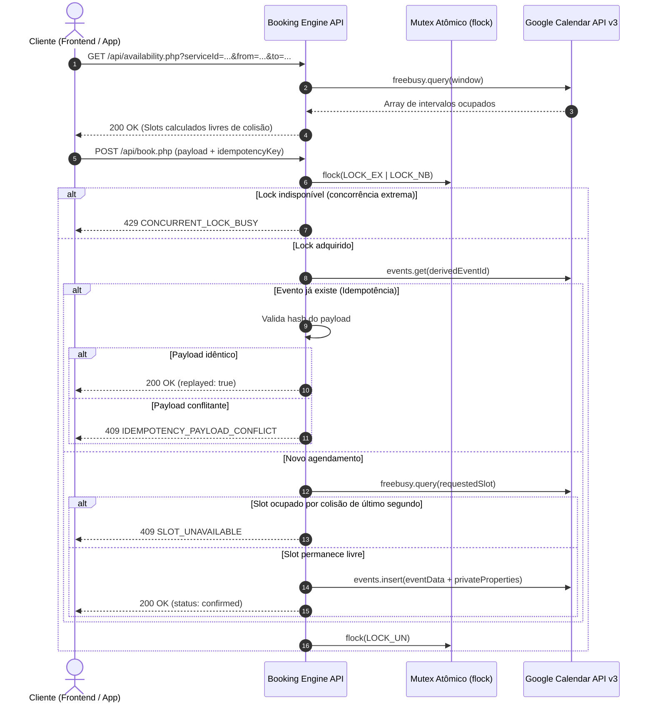

# google-calendar-booking-engine

> Engine transacional de agendamento em PHP 8.3 com Google Calendar como *Single Source of Truth*, controle de concorrência via exclusão mútua em arquivo (`flock`), rate limiting deslizante atômico e garantia de idempotência de ponta a ponta.

[](https://php.net)
[](https://developers.google.com/calendar)
[](LICENSE)

---

## 1. Contexto e Motivação Arquitetural

Sistemas tradicionais de agendamento baseados em bancos de dados relacionais (MySQL/PostgreSQL) operando em paralelo com o Google Calendar sofrem cronicamente de **drift de estado**:
* Mutações diretas efetuadas na interface do Google Calendar (cancelamentos, reagendamentos manuais pelo operador ou bloqueios de expediente no dispositivo móvel) exigem pipelines complexos de sincronização bidirecional (webhooks, workers assíncronos e reconciliação periódica).
* Falhas transitórias de entrega de webhooks ou latência de propagação criam janelas temporais de inconsistência, resultando em sobreposições e agendamentos duplicados (*double-booking*).

### Decisão de Engenharia
Este motor adota o **Google Calendar como repositório canônico e única fonte da verdade**. 
* Não há banco de dados intermediário para espelhamento de eventos.
* A disponibilidade é calculada diretamente sobre os vetores de ocupação retornados pela API de `freeBusy`.
* A persistência de agendamentos é atômica, delegando o controle de concorrência e idempotência ao ciclo de execução do backend via metadados estendidos da própria API.

---

## 2. Padrões de Engenharia e Resiliência

### 2.1 Exclusão Mútua via File Locks (`flock`)
Para eliminar condições de corrida (*race conditions*) durante a confirmação de horário em ambientes compartilhados ou sob múltiplas requisições concorrentes sem a dependência de um cluster Redis:
* A transação de criação de agendamento adquire uma trava de arquivo exclusiva não-bloqueante (`flock(LOCK_EX | LOCK_NB)`).
* Sob posse do lock, o worker revalida o intervalo temporal contra a API `freeBusy` do Google Calendar imediatamente antes da emissão do `events.insert`.
* Concorrências que colidam na mesma fração de segundo são interceptadas na borda e rejeitadas deterministicamente com `HTTP 429` (lock ocupado) ou `HTTP 409` (slot consumido).
* A liberação do lock ocorre obrigatoriamente no bloco `finally`.

### 2.2 Idempotência de Ponta a Ponta via Propriedades Privadas
Toda requisição de mutação exige uma chave de idempotência (`idempotencyKey` UUID v4):
* O identificador do evento no Google Calendar é derivado deterministicamente como `hash('sha256', $idempotencyKey)[0..39]`.
* O payload normalizado é assinado com SHA-256 (`payloadHash`) e armazenado nas `extendedProperties.private` do evento do Google Calendar.
* **Detecção de Replay:** Se a mesma chave for recebida com o mesmo hash, a API retorna o registro pré-existente com `replayed: true` e status `200 OK`.
* **Detecção de Conflito:** Se a mesma chave for reenviada com payload divergente, a requisição é abortada com `HTTP 409 IDEMPOTENCY_PAYLOAD_CONFLICT`.

### 2.3 Rate Limiting Deslizante sem Infraestrutura Externa
A classe [`RateLimiter`](src/RateLimiter.php) provê controle de vazão atômico por IP diretamente no sistema de arquivos:
* Cada tupla `hash(bucket | identity)` armazena uma série temporal JSON compacta de timestamps sob `flock(LOCK_EX)`.
* Registros obsoletos fora da janela deslizante (ex: 60 segundos) são truncados e expurgados a cada escrita.
* Protege endpoints sensíveis (`book`, `availability`) contra exaustão de cota da Google Calendar API.

### 2.4 Padrão Gateway com Dublê In-Memory
A fronteira com o calendário é isolada pela interface [`CalendarGateway`](src/CalendarGateway.php):
* [`GoogleCalendarGateway`](src/GoogleCalendarGateway.php): Implementação de produção com autenticação via Service Account e tratamento mapeado de falhas transitórias (HTTP 401/403/503).
* [`FakeCalendarGateway`](src/FakeCalendarGateway.php): Implementação in-memory determinística utilizada pela suíte de validação automatizada, permitindo testes sem IO de rede ou chaves de API.

### 2.5 Defesa em Profundidade na Borda HTTP
* **Honeypot:** Campo de controle `website` inspecionado logo no início do payload.
* **Turnstile:** Verificação do token de desafio Cloudflare contra a API de verificação de site.
* **Origem Estrita:** Validação de cabeçalho `Origin` contra `APP_ORIGIN` para mitigação de cross-site abuse.
* **Normalização Estrita:** Rejeição de caracteres de controle UTF-8 e validação de padrões de telefone via regex compilada.

---

## 3. Topologia e Fluxo de Execução



---

## 4. Contratos de API e Especificação

### `GET /api/config.php`
Retorna os metadados públicos de catálogo, expediente e parâmetros de antecedência.

---

### `GET /api/availability.php`
Calcula slots disponíveis cruzando a matriz de expediente (`config/booking.php`) com os bloqueios retornados pela API `freeBusy`.

| Parâmetro | Tipo | Restrições |
| :--- | :--- | :--- |
| `serviceId` | `string` | Obrigatório. ID registrado no catálogo |
| `from` | `string` | Obrigatório. Data ISO `YYYY-MM-DD` |
| `to` | `string` | Obrigatório. Data ISO `YYYY-MM-DD` (máx. 14 dias após `from`) |

---

### `POST /api/book.php`
Executa o agendamento sob exclusão mútua e persistência atômica.

#### Payload de Entrada:
```json
{
  "idempotencyKey": "a8793b54-79b8-4720-94e8-468e80735399",
  "serviceId": "service-standard",
  "addOns": ["addon-special"],
  "start": "2026-09-25T10:00:00-03:00",
  "customerName": "Maria Silva",
  "whatsapp": "11999998888",
  "notes": "Atendimento preferencial.",
  "website": ""
}
```

#### Resposta de Sucesso (`200 OK`):
```json
{
  "status": "confirmed",
  "replayed": false,
  "booking": {
    "reference": "BK-A8793B54",
    "serviceId": "service-standard",
    "serviceName": "Atendimento Padrão",
    "addOns": [
      {
        "id": "addon-special",
        "name": "Procedimento Adicional",
        "priceIncrementCents": 2000
      }
    ],
    "start": "2026-09-25T10:00:00-03:00",
    "end": "2026-09-25T10:40:00-03:00",
    "customerName": "Maria Silva",
    "notes": "Atendimento preferencial.",
    "estimatedPrice": {
      "currency": "BRL",
      "fromCents": 7000
    }
  },
  "whatsapp": {
    "message": "Agendamento confirmado:\n\nNome: Maria Silva...",
    "url": "https://wa.me/5511999999999?text=..."
  }
}
```

#### Respostas de Erro Mapeadas:
* `400 INVALID_REQUEST`: Validação de esquema, método ou honeypot.
* `405 METHOD_NOT_ALLOWED`: Método HTTP divergente do especificado.
* `409 SLOT_UNAVAILABLE`: Conflito temporal de agendamento na agenda canônica.
* `409 IDEMPOTENCY_PAYLOAD_CONFLICT`: Reutilização de chave para payload divergente.
* `422 TURNSTILE_INVALID`: Falha na checagem do token de desafio anti-bot.
* `429 RATE_LIMITED / CONCURRENT_LOCK_BUSY`: Excesso de requisições ou lock em disputa.
* `503 CALENDAR_UNAVAILABLE`: Degradação ou indisponibilidade no upstream do Google.

---

## 5. Estrutura do Repositório

```text
├── config/
│   └── booking.php              # Matriz de regras de negócio e catálogo
├── public/
│   ├── .htaccess                # Restrições de acesso a arquivos sensíveis
│   └── api/
│       ├── availability.php     # Endpoint de consulta de disponibilidade
│       ├── book.php             # Endpoint transacional de criação
│       ├── bootstrap.php        # Pipeline comum, helpers e error handling
│       ├── config.php           # Endpoint de parâmetros públicos
│       └── health.php           # Probe de saúde da integração com o Google
├── src/
│   ├── CalendarGateway.php      # Contrato de abstração da agenda
│   ├── FakeCalendarGateway.php  # Dublê in-memory determinístico
│   ├── GoogleCalendarGateway.php# Adaptador da Google Calendar API v3
│   └── RateLimiter.php          # Limitador de requisições com lock atômico
├── tests/
│   └── backend.php              # Suite determinística offline
├── .env.example                 # Esquema de configuração de ambiente
├── composer.json                # Dependências e mapeamento PSR-4
└── README.md
```

---

## 6. Suite de Validação Automatizada

O script [`tests/backend.php`](tests/backend.php) executa a validação offline determinística das garantias do motor sem dependência de chaves de API ou conexão externa:

```bash
php tests/backend.php
```

### Cobertura de cenários:
1. **Detecção de Conflito Temporal:** Intersecção estrita de intervalos ocupados (`busy`).
2. **Isolamento de Janelas Adjacentes:** Ausência de falsos positivos em horários contíguos.
3. **Persistência de Idempotência:** Armazenamento e integridade de metadados em `privateProperties`.
4. **Consistência de Esquema:** Integridade do catálogo de serviços e mapeamentos de cores.
5. **Rate Limiting e Concorrência:** Admissão e descarte estrito sob limiar de requisições.

---

## 7. Configuração e Execução em Produção

### 1. Requisitos
* PHP 8.3+ com extensões `curl`, `json`, `mbstring`, `openssl`.
* Composer.
* Google Cloud Console: Projeto ativo com **Google Calendar API** habilitada e Service Account provisionada.

### 2. Provisionamento de Credenciais Google
1. Crie uma Service Account no Google Cloud IAM e exporte a chave em formato `.json`.
2. No Google Calendar, crie a agenda da operação e conceda ao e-mail da Service Account a permissão **"Make changes to events"**.
3. Obtenha o ID da agenda em *Configurações da Agenda -> Integrar agenda*.

### 3. Variáveis de Ambiente
Defina no ambiente do PHP (fora do `DocumentRoot` público):

```env
APP_ENV=production
APP_ORIGIN=https://app.seudominio.com

GOOGLE_CALENDAR_ID=id-da-agenda@group.calendar.google.com
GOOGLE_CREDENTIALS_PATH=/var/credentials/service-account.json

# Opcional: Chave secreta de validação Cloudflare Turnstile
TURNSTILE_SECRET_KEY=

# Canal de continuidade operacional
BUSINESS_WHATSAPP=5511999999999
```

---

## 8. Licença

Distribuído sob a licença [MIT](LICENSE).
Desenvolvido por [Emanoel](https://github.com/emanoeI).
